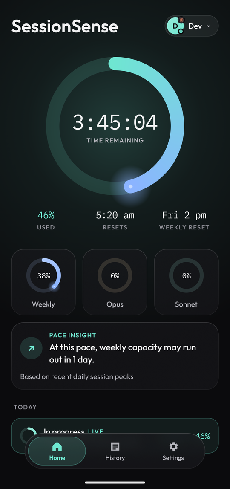
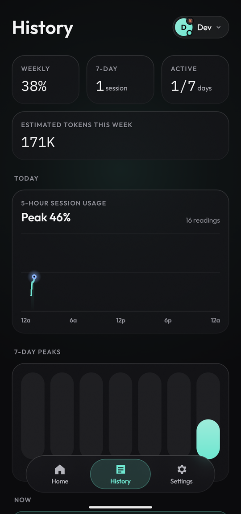
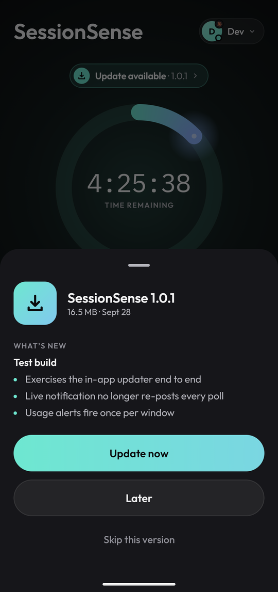
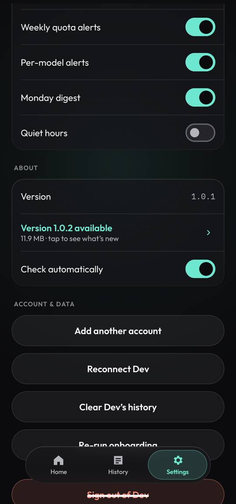
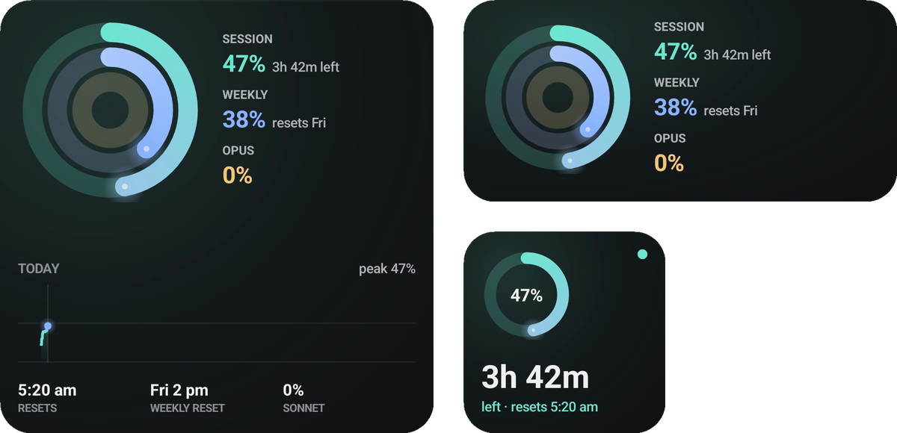
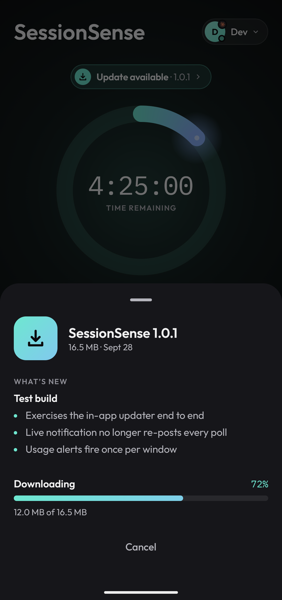
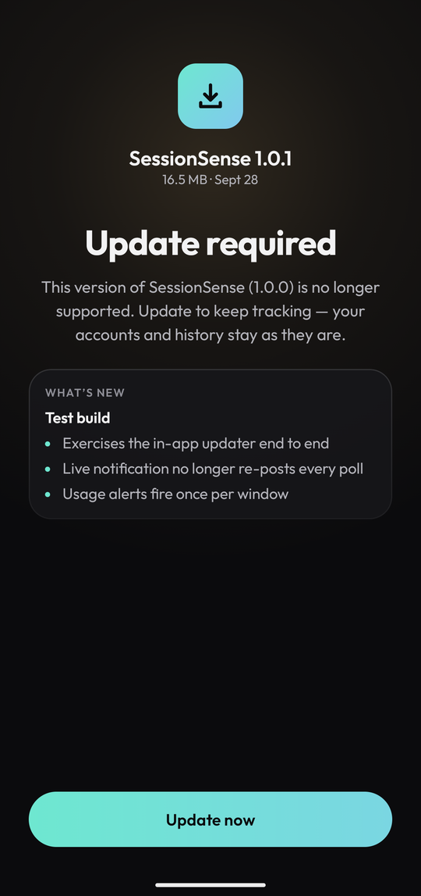

<div align="center">

# SessionSense: Claude & Codex usage tracker for Android

**Know exactly where you stand with your Claude and Codex limits — right from your phone.**

A live 5-hour session ring, weekly quotas, alerts before you hit a wall, history, and home-screen widgets.<br>
Free and open source (MIT) · [devxd98.github.io/sessionsense](https://devxd98.github.io/sessionsense/)

[](https://github.com/DevxD98/sessionsense/releases/latest/download/sessionsense.apk)
[](https://github.com/DevxD98/sessionsense/releases/latest)

[](LICENSE)
[](https://github.com/DevxD98/sessionsense/actions/workflows/ci.yml)

<br>

&nbsp;
&nbsp;
&nbsp;


</div>

**SessionSense** is a free, open-source Android app that tracks your **Claude usage limits** and **Codex usage limits**
in real time. It shows how much of your **Claude Pro, Max or Team** plan's **5-hour session limit** and **weekly limit**
you've used, including what **Claude Code** draws from the same plan. It does the same for **Codex** on a
**ChatGPT** plan. Alerts reach you before you hit a rate limit, and home-screen widgets keep the numbers one glance
away. There's no account to create, no server and no analytics: it reads your usage straight from claude.ai and
chatgpt.com on your phone.

## What it does

| | |
|---|---|
| ⏱️ **Live session window** | See how much of your current 5-hour window is used and exactly when it resets, as an Apple Fitness–style ring. |
| 📊 **Weekly quotas** | Weekly usage plus per-model Opus and Sonnet allowances, with a pace insight that tells you if the week will last. |
| 🔔 **Alerts that respect you** | Heads-ups at 60, 30 and 10 minutes left, when a window resets, and when weekly quota gets tight. Each fires once. Quiet hours silence everything except the final 10-minute warning. |
| 🧭 **Planner** | See when the current 5-hour window would hit its limit at your pace, get notified when a session or weekly reset lands, and hold back part of your weekly limit with Reserve mode. |
| 📈 **History** | Every session and usage reading is saved on your phone: today's curve, 7-day peaks and past sessions. |
| 🧩 **Home-screen widgets** | *Session ring*, *Activity rings* and *Today*, in three sizes. |
| 👥 **Up to 3 accounts** | Claude (Pro, Team, Max) and ChatGPT-plan **Codex** limits side by side. Switch in a tap. |
| 🔄 **Updates itself** | New versions show up in the app. One tap downloads, verifies and installs them, and your data stays put. |

## Widgets

Glance at your limits without opening the app: **Today** (large), **Activity rings** (wide) and **Session ring** (small).
They follow the account you're viewing and refresh as usage changes.

<p align="center"></p>

## Install

1. **Download** [`sessionsense.apk`](https://github.com/DevxD98/sessionsense/releases/latest/download/sessionsense.apk) on your Android phone (Android 8.0 or newer), or grab it from the [latest release](https://github.com/DevxD98/sessionsense/releases/latest).
2. **Open** the downloaded file. If Android asks, allow your browser or file manager to *install unknown apps* — SessionSense isn't on the Play Store, so Android wants a one-time OK.
3. **Sign in** with Claude on claude.ai itself (and optionally add a ChatGPT account for Codex). Allow notifications if you want alerts.

That's it. Add a widget from your home screen's widget picker if you like.

Prefer an app manager? Add the repo to [Obtainium](https://github.com/ImranR98/Obtainium) and it installs and updates
SessionSense straight from these releases:

<a href="https://apps.obtainium.imranr.dev/redirect?r=obtainium://add/https://github.com/DevxD98/sessionsense"></a>

## Updates

You only install SessionSense once. After that it **updates from inside the app**:

- It checks for new versions when you open it and once a day in the background, and sends one notification per new version (never during quiet hours).
- Tap **Update now** and it downloads the new version, checks it (see below), and hands it to Android's installer. Your accounts, history and settings are kept.
- Check yourself any time under **Settings → About → Check for updates**, or turn automatic checks off there.

<p align="center">
&nbsp;

</p>

Rarely, a version may be too old to keep working (for example, if an API it relies on changes). In that case the app shows an **Update required** screen, and one tap brings you up to date.

## Privacy & security

- **Your sign-in never leaves your phone.** You log in on claude.ai / chatgpt.com in an in-app browser; SessionSense never sees your password. Only the session cookies and tokens needed to read your usage are stored, encrypted with the Android Keystore.
- **No servers, no analytics.** The app talks to claude.ai / chatgpt.com for your usage, and to GitHub (this repository) to look for updates. Nothing else.
- **Updates are verified before installing.** Each release's `update.json` publishes the APK's SHA-256. The app refuses any download whose hash doesn't match, or that isn't signed with the same certificate as the app you already have. Downloads are HTTPS-only and may only come from GitHub.

To check a downloaded APK yourself:

```sh
shasum -a 256 sessionsense.apk                       # compare with "sha256" in the release's update.json
apksigner verify --print-certs sessionsense.apk      # certificate SHA-256 digest must be:
# c0c76e371449b071e17e010dd82212a78463111fcb9483cab52f9f624a88341b
```

## Troubleshooting

<details>
<summary><b>"App not installed" or "package conflicts with an existing package"</b></summary>

You have a copy of SessionSense signed with a different key (for example, a developer build). Uninstall it first, then install the APK from here. Uninstalling removes that copy's local history and sign-ins.
</details>

<details>
<summary><b>The update says "Signed by a different key"</b></summary>

Same cause as above: the installed copy wasn't installed from this page. Uninstall it once and install from the latest release. Every update after that works in place.
</details>

<details>
<summary><b>No alerts or the live notification disappears</b></summary>

Make sure notifications are allowed for SessionSense, and exclude it from battery optimisation (*Settings → Apps → SessionSense → Battery → Unrestricted*). Some phones stop background apps aggressively.
</details>

<details>
<summary><b>"Session expired — tap to reconnect"</b></summary>

claude.ai or chatgpt.com signed you out (this happens after a while, or if you sign out on the web). Tap the banner and sign in again; your history is kept.
</details>

## FAQ

<details>
<summary><b>How do I check my Claude usage limit on my phone?</b></summary>

Install SessionSense, sign in with your Claude account in the app, and Home shows your current 5-hour session usage,
your weekly usage and when each one resets. Add a widget to see it without opening the app.
</details>

<details>
<summary><b>Does it track Claude Code usage?</b></summary>

Yes. Claude Code on a Pro or Max plan uses the same 5-hour and weekly limits as claude.ai, so SessionSense shows how
much you have left whether you spend it in chat or in Claude Code.
</details>

<details>
<summary><b>Does it work with Codex and ChatGPT?</b></summary>

Yes. Add a ChatGPT account and SessionSense shows your Codex usage limits alongside Claude. You can add up to three
accounts and switch between them with one tap.
</details>

<details>
<summary><b>When does my Claude limit reset?</b></summary>

Claude uses a rolling 5-hour session window plus a weekly limit. SessionSense shows the exact reset time for both,
counts down to it, and can notify you when a window resets.
</details>

<details>
<summary><b>Is it safe? Does it see my password?</b></summary>

No. You sign in on claude.ai or chatgpt.com in an in-app browser, and SessionSense never sees your password. Only
the session needed to read your usage is stored, encrypted on your phone. The code is open source, so you can check.
See [Privacy & security](#privacy--security).
</details>

<details>
<summary><b>Is there an iPhone or desktop version?</b></summary>

Not yet. SessionSense is Android only (Android 8.0+). It isn't on the Play Store; install the APK from
[Releases](https://github.com/DevxD98/sessionsense/releases/latest), and it updates itself after that.
</details>

<details>
<summary><b>Is it official?</b></summary>

No. SessionSense is an independent open-source project, not made by Anthropic or OpenAI.
</details>

## Build from source

SessionSense is a native Android app: Kotlin, Jetpack Compose, Glance widgets, Room and WorkManager. You need
**JDK 17** and the Android SDK (Android Studio sets both up; open the repository root as the project).

```sh
git clone https://github.com/DevxD98/sessionsense.git && cd sessionsense
./gradlew assembleSideloadDebug          # APK in app/build/outputs/apk/sideload/debug/
./gradlew installDebug                   # or build and install on a connected phone
./gradlew testDebugUnitTest lintDebug    # what CI runs
```

Debug builds need no keystore. A debug build is signed with a different key from the published APK, so it can't
update an installed release copy (or vice versa); uninstall one before installing the other.

There are two flavors: **`sideload`** (the published APK, with the in-app updater) and **`play`** (no updater and no
install-packages permission). Maintainers cut releases with `scripts/release.sh`; see [RELEASING.md](RELEASING.md).

## Contributing

Bug reports, ideas and pull requests are welcome. Read [CONTRIBUTING.md](CONTRIBUTING.md) first, and report security
issues privately as described in [SECURITY.md](SECURITY.md), not in a public issue.

## Releases

Every version is listed under [Releases](https://github.com/DevxD98/sessionsense/releases). Each release contains the APK and the `update.json` manifest the app reads. **Pre-releases** are test builds: they're never offered to installed apps and may be deleted.

## License

SessionSense is released under the [MIT License](LICENSE). Bundled fonts and the provider logos have their own terms;
see [THIRD_PARTY_NOTICES.md](THIRD_PARTY_NOTICES.md).

<sub>SessionSense is an independent app and isn't affiliated with Anthropic or OpenAI. Claude is a trademark of Anthropic; ChatGPT and Codex are trademarks of OpenAI. It reads usage from the same web endpoints the official sites use; they're undocumented and can change without notice.</sub>
